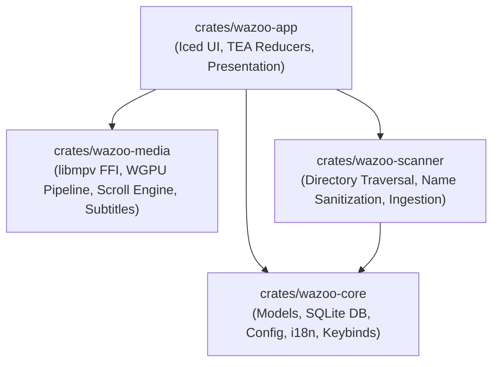
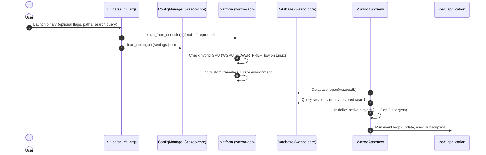
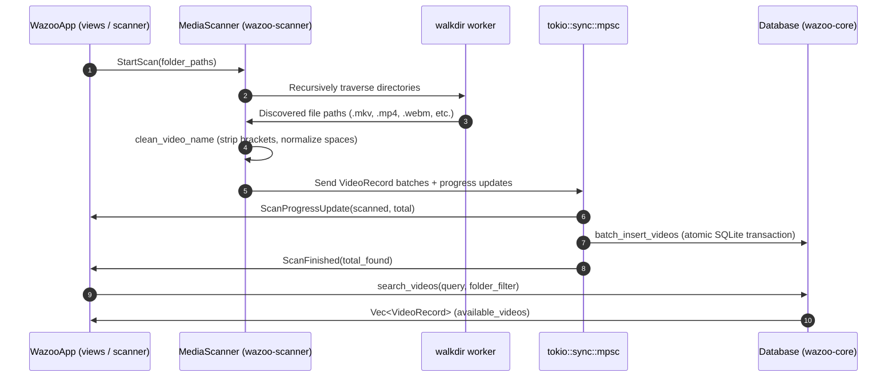
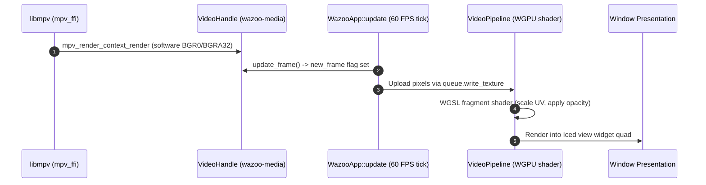
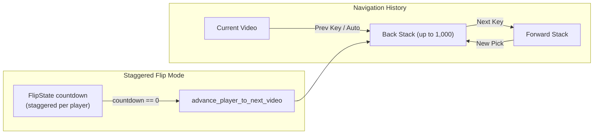
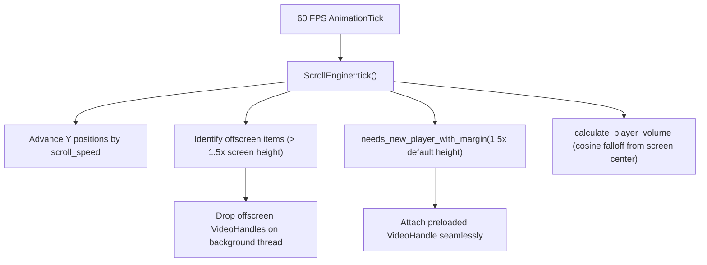

# Wazoo Architecture & Subsystems Documentation

Welcome to the technical architecture and logic flow documentation for the **Wazoo** codebase.

Wazoo is a high-performance ambient video player and moving mood-board written in native Rust. It is built around **The Elm Architecture (TEA)** using [Iced](https://github.com/iced-rs/iced), backed by **`libmpv`** for video decoding, **WGPU** for hardware-rendered frame composition, and **SQLite** for instant library indexing and search.

---

## 🏛️ Workspace Topology

The repository is organized as a Cargo workspace with five specialized crates, each maintaining strict separation of concerns:

### Crate Roles & Summaries

| Crate | Primary Role | Key Dependencies | Documentation |
| :--- | :--- | :--- | :--- |
| [**`wazoo-core`**] | Domain models, SQLite database management, settings persistence, localization, and keybinding configuration. | `rusqlite`, `serde`, `directories`, `regex` | [Core Architecture] |
| [**`wazoo-media`**] | High-level media playback (`VideoHandle`), low-level C FFI bindings to `libmpv`, custom WGPU shader rendering pipeline, continuous scroll physics engine, and subtitle transcript parsing. | `iced_wgpu`, `wgpu`, `bytemuck`, `tokio`, `rand` | [Media Architecture] |
| [**`wazoo-scanner`**] | Asynchronous directory scanner, media file validation, filename sanitization, and streaming database batching. | `walkdir`, `tokio`, `regex`, `wazoo-core` | [Scanner Architecture] |
| [**`wazoo-app`**] | Main desktop application entry point, TEA state machine, modular update reducers, UI components, multi-tile layout engines, drawers, and modal dialogs. | `iced`, `wazoo-core`, `wazoo-media`, `wazoo-scanner` | [App Architecture] |

---

## 🔄 Core System Logic Flows

### 1. Application Startup & Initialization Flow

1. **CLI Parsing**: Reads optional media folders, direct video files, search queries, or flags.
2. **Platform Setup**:
   - Detaches from console on Windows/Linux GUI launches.
   - Detects Linux dual-GPU hybrid laptops to prevent PRIME DRI3 swapchain deadlocks by selecting the low-power GPU.
3. **Configuration & DB**: Opens SQLite database with WAL mode and indices, restores `settings.json`, and loads persisted window geometry and volume levels.
4. **Player Initialization**: Spawns initial [`VideoHandle`] instances with staggered random offsets or saved session timestamps.

---

### 2. Media Ingestion & Search Pipeline

- **Clean Parsing**: Bracketed tags (`[1080p]`, `[DualAudio]`) and underscores are stripped for clean UI display while preserving canonical filesystem paths.
- **Atomic Transactions**: Video records are batched into SQLite transactions for high throughput when indexing tens of thousands of files.
- **Search Logic**: Supports comma-separated multi-clause filtering, negation (`!term` or `not term`), and instant folder scoping.

---

### 3. Video Playback & Rendering Pipeline

- **Decoupled Playback**: `libmpv` runs its own internal demuxer and decoding threads without blocking the GUI event loop.
- **Software Presentation**: `libmpv` renders frames into an internal BGRA32 pixel buffer via `mpv_render_context`.
- **WGPU Shader Pipeline**: `VideoPipeline` uploads updated frames to GPU textures on the 60 FPS animation tick, supporting seamless multi-tile rendering without window handle limitations.

---

### 4. Navigation, Shuffle History & Flip Mode

- **Per-Player Flip State**: Each active player maintains its own independent, staggered flip countdown (`FlipState`) so multiple tiles rotate asynchronously without jarring simultaneous visual cuts.
- **Bi-Directional History**: Navigating backwards restores the exact previous video and timestamp. Users can scrub forward and backward through past visual inspiration.

---

### 5. Continuous Vertical Feed (Scroll Mode)

- **Aspect-Ratio Aware Layout**: Each item's height in the scroll feed is dynamically derived from its native video aspect ratio.
- **Zero-Stutter Preloading**: The next video in the feed is preloaded in the background and attached instantly once the scroll position reaches the lookahead threshold.
- **Non-Blocking Despawning**: Offscreen players are dropped on a separate thread to prevent audio or GPU frame drops.
- **Distance-Based Cross-Fading**: Audio volume transitions smoothly based on proximity to the vertical center of the window.

---

## 📑 Detailed Crate Documentation

Dive deeper into specific subsystem implementations:

1. [**`wazoo-core` Architecture**](wazoo-core.md)
   - Configuration management, atomic file saving, SQLite query builder, localization, and keybinding translation.
2. [**`wazoo-media` Architecture**](wazoo-media.md)
   - `libmpv` FFI initialization, WGPU shader pipeline, `VideoHandle` API, scroll physics, and subtitle transcript parsing.
3. [**`wazoo-scanner` Architecture**](wazoo-scanner.md)
   - Media discovery, directory recursion, filename normalization, and streaming channels.
4. [**`wazoo-app` Architecture**](wazoo-app.md)
   - TEA application state, modular message reducers, multi-tile layout engines, slide drawers, frameless titlebar, and subscriptions.
