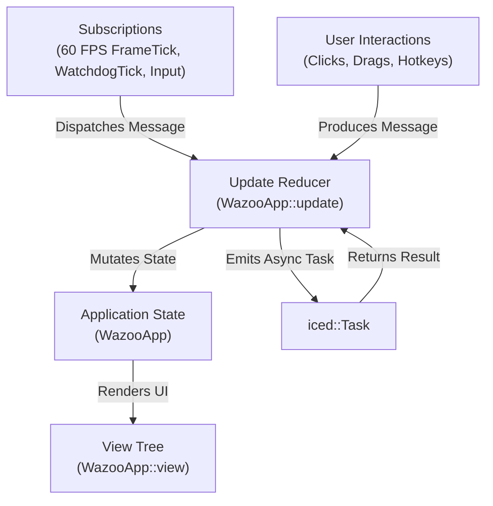
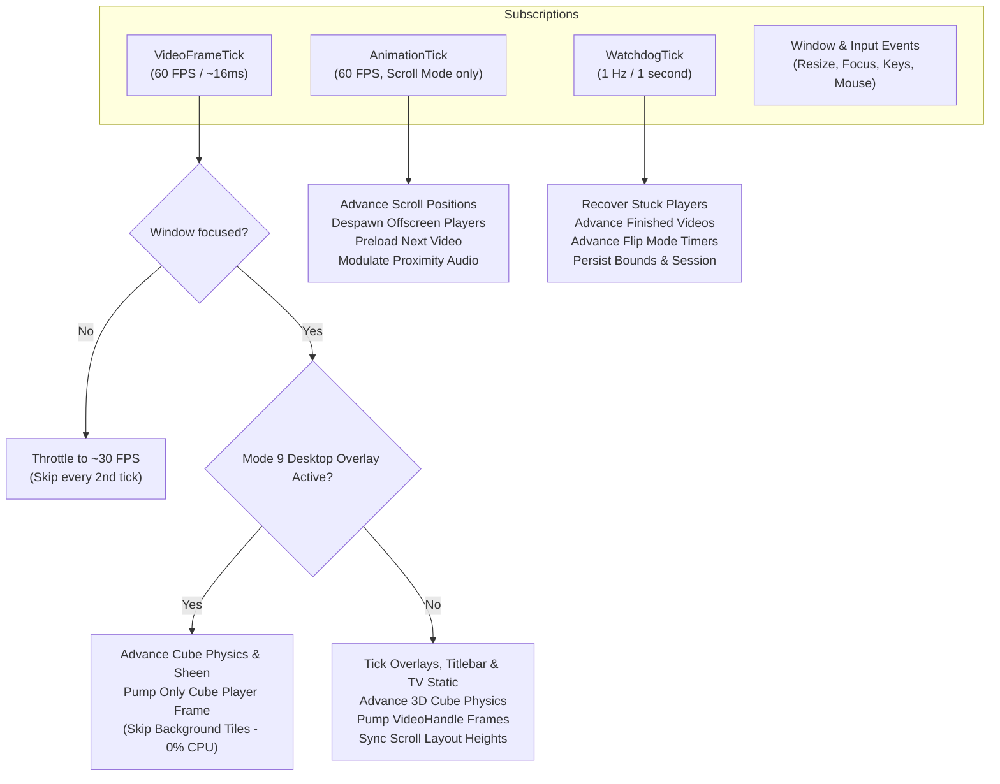

# `wazoo-app` Subsystem Architecture

The [`wazoo-app`] crate is the central desktop application. It integrates `wazoo-core`, `wazoo-media`, and `wazoo-scanner` using **The Elm Architecture (TEA)** pattern implemented with [Iced](https://github.com/iced-rs/iced).

---

## 📁 Module Organization

```
crates/wazoo-app/src/
├── app.rs          # WazooApp struct, state definitions, and helper methods
├── assets.rs       # Embedded font, SVG icon, and raw TV static frame loaders
├── cli.rs          # Command-line interface argument parser
├── cursor.rs       # Frameless window resize cursor hit-testing and edge detection
├── format.rs       # Display name sanitization and title formatting utilities
├── keybinds.rs     # Key-to-message translation and custom shortcut binding
├── lib.rs          # Application entry point, window bootstrap, and run loop
├── main.rs         # Standalone binary entry point
├── message.rs      # Exhaustive enum of all UI and engine events (Message)
├── platform.rs     # OS-specific hooks (Linux PRIME check, console detaching)
├── scroll_view.rs  # Vertical feed layout container and shader quad integration
├── slide.rs        # Smooth animation curve and easing functions
├── state/          # Subsystem state encapsulations (players, cube, overlays, flip timers)
├── theme/          # Custom color palettes, dark styling, and container themes
├── update/         # TEA state reducers partitioned by functional domain
├── views/          # Declarative Iced UI widgets, layouts, modals, and drawers
└── wrap.rs         # Dynamic horizontal wrapping layout widget for badges and tags
```

---

## 🏗️ The Elm Architecture (TEA) in Wazoo

Wazoo follows strict unidirectional data flow:



### State Decomposition (`WazooApp`)

To prevent a monolithic god object, application state in [`WazooApp`] is partitioned into focused child states:

- **`players: PlayerList`**: Collection of [`AppPlayer`] handles, each wrapping a `VideoHandle` with per-tile shuffle mode, undo/redo history stacks, loading state, independent `FlipState`, and dedicated cube-rendering player flags (`is_cube`).
- **`window: WindowState`**: Tracks cursor position, focus status, Alt-drag movement, window resize directions, mouse clickthrough mode, and native borderless **Fullscreen Mode** (`is_fullscreen`).
- **`titlebar: TitlebarState`**: Controls sliding titlebar visibility, hover delays, hide timers, dropdown menu slide transitions, and auto-hide behavior during fullscreen mode.
- **`overlay: OverlayState`**: Governs player HUD alpha fades, spinner rotation angles, toast alerts, title pill badges, and cube focus border flash timers (`focus_border_ticks`).
- **`drawers: DrawerState`**: Holds visibility and search states for the File Browser, Subtitle Transcript, and Play History side drawers.
- **`modals: ModalState`**: Manages modal dialog visibility (Find/Search, Settings, Bookmarks, Help, Menu) with tabbed settings (`General`, `Playback`, `Filters`, `System`, `Cube`).
- **`cube: CubeState`**: Manages interactive 3D bouncing video cubes (`BouncingCube`), 3D Euler angles, velocities, bounce collision counters, speed/size multipliers, and transparent desktop screensaver overlay mode (Mode 9).
- **`raw_static_frames: Vec<RawStaticFrame>` & `static_frame: Arc<Mutex<FrameData>>`**: Dynamic raw RGBA TV static noise frame buffers pumped through the WGPU shader pipeline for loading/buffering video quads so active shaders (CRT, Wavy, Fog) naturally apply to static.
- **`settings: WazooSettings`**: Active configuration loaded from `wazoo-core`, including master and individual post-processing filter states (`filters_enabled`, `filter_crt`, `filter_wavy`, `filter_fog`), cube screensaver presets, and custom keybindings.
- **`scroll_engine: ScrollEngine`**: Active layout and physics engine from `wazoo-media`.

---

## ⚡ The Modular Update Subsystem (`update/`)

Incoming [`Message`] events are dispatched through domain-specific reducers in [`crates/wazoo-app/src/update/`]:

| Module | Responsibility |
| :--- | :--- |
| [**`mod.rs`**] | Primary match dispatcher, `AnimationTick`, `VideoFrameTick`, and `WatchdogTick` orchestrators. |
| [**`window.rs`**] | Window focus, resize, move, Alt-drag, dropdown menu, click-through pinning, titlebar animations, and Fullscreen Mode (`F11`) with mutual exclusion against Mode 9. |
| [**`playback.rs`**] | Multi-tile playback commands, volume, mute, seek, A-B loop, speed, layout cycling, audio tracks, and master shader filter toggling (`toggle_filters` / key `7`). |
| [**`navigation.rs`**] | Next/prev video, bi-directional navigation history stacks, and video auto-advancement. |
| [**`cube.rs`**] | 3D Video Cube screensaver (Mode 8), Desktop Overlay Mode (Mode 9), cube spawning/clearing, speed/size/sheen adjustments, and fullscreen coordination. |
| [**`drawers.rs`**] | File picker navigation, folder collapsing, transcript cues, and play history clearing. |
| [**`modals.rs`**] | Settings tab switching (General, Playback, Filters, System, Cube), post-processing filter toggles (CRT, Wavy, Fog), audio language preferences, equalizer sliders, and bookmarks. |
| [**`search.rs`**] | Search input changes, folder tag toggling, and instant query execution. |
| [**`scanner.rs`**] | Native folder pickers (`rfd`), scan progress updates, and library reloading. |
| [**`input.rs`**] | Hardware keyboard and mouse events mapped to configurable `KeyAction` commands (`F11` fullscreen, `7` master filters, `8` cube screensaver, `9` desktop overlay). |

---

## ⏱️ Engine Ticks & Subscriptions

Wazoo maintains three distinct subscription timers:



### Video Frame Tick Optimizations

Inside [`Message::VideoFrameTick`]:
1. **Unfocused Throttling**: When the window is unfocused or occluded, frame ticks drop to ~30 FPS to reduce GPU swapchain pressure while keeping background movie playback smooth.
2. **Overlay & TV Static Ticks**: Ticks spinner angles, hud fades, file picker search debouncing, and advances real-time TV static noise generator frames (`static_frame`).
3. **3D Cube Physics Simulation**: Advances Euler angles, velocities, boundary collision bounces, and specular sheen angles for all floating cubes in Mode 8 & Mode 9.
4. **Desktop Overlay Power Conservation**: When Desktop Overlay Mode (Mode 9) is active, background player frame pumps are bypassed; only the active 3D cube player texture is refreshed, eliminating redundant decoding CPU cycles while the transparent screensaver is running.
5. **Titlebar Animation Machine**: Runs titlebar slide transitions, drag detection timeouts, and dropdown menu animations.
6. **Frame Rendering**: Pumps `VideoHandle::update_frame()` across all active tiles.
7. **Scroll Layout Sync**: Adjusts scroll item heights dynamically when aspect ratios change.

---

## 🎨 View Layer & Components (`views/`)

Wazoo's user interface is fully custom and frameless:

- **Multi-Tile Playback Layouts ([`views/player/`]):**
  - **Grid**: Displays 1 to 12 players in an adaptive multi-column/row matrix.
  - **Row**: Aligns players horizontally in a continuous filmstrip.
  - **Column**: Stacks players vertically.
  - **Scroll**: Infinite vertical feed container rendered via [`scroll_view.rs`].
- **3D Video Cube Screensaver & Desktop Overlay Mode ([`views/cube.rs`]):**
  - Interactive spinning 3D cubes projecting live video onto all 6 faces using custom software/GPU projection math, specular sheen highlights, and bouncing collision physics.
  - **Mode 8 (In-App Screensaver)**: Renders floating 3D cubes over the playback canvas within the application window.
  - **Mode 9 (Desktop Overlay Mode)**: Borderless, mouse-passthrough transparent desktop overlay screensaver with background tile decoding paused to eliminate CPU overhead, allowing underlying desktop apps to remain fully visible and usable.
  - **Interactive Sheen & Focus Flashes**: Specular sheen lighting bands sweep across cube faces, and an emerald green neon border flashes when cycling focused cubes.
- **GPU Post-Processing Shader Filters ([`views/modals/settings/filters_tab.rs`]):**
  - Centralized master filter toggle (`7` key) applying all enabled GPU filters simultaneously across all video quads:
    - **CRT Scanline & Phosphor Glow**: Spherical tube curvature distortion, scanline grid rasterization, phosphorescent bloom/glow, RGB subpixel chromatic aberration, analog RF noise, and radial vignette falloff.
    - **Wavy Fluid Displacement**: Procedural sinusoidal UV distortion creating liquid rippling effects.
    - **Volumetric Fog**: Multi-octave fractional Brownian motion (fBm) procedural noise generating ambient drifting smoke across the frame.
    - **Aspect-Ratio Border Protection**: Strict clamping against normalized content boundaries (`target_aspect`), preventing edge-smear artifacts when displaying non-16:9 aspect ratios.
- **Shader-Processed TV Static Loading State ([`views/player/card.rs`]):**
  - Instead of a flat GIF overlay, loading/buffering screens render raw static RGBA frames through the WGPU `VideoProgram` shader pipeline (`0x8000_0000 | player_id`), ensuring CRT curvature, scanlines, wavy ripples, and volumetric fog naturally affect the static noise.
- **Fullscreen Windowing Mode (F11):**
  - Borderless native fullscreen toggling with mutual exclusion against Mode 9 desktop overlay, dynamic keybind hints (`F11`), and graceful escape handling.
- **Frameless Titlebar ([`views/titlebar.rs`]):**
  - Slides down on hover or window movement; auto-retracts when idle.
  - Contains window controls (minimize, maximize, fullscreen, close), current video title, and quick drop-down menu.
- **Drawers & Modals:**
  - **File Picker ([`views/file_picker.rs`])**: Collapsible directory browser with video counts and instant search.
  - **Transcript ([`views/transcript.rs`])**: Synchronized dialogue subtitles with click-to-seek and track selector.
  - **Play History ([`views/history.rs`])**: Chronological session playback history with deduplication.
  - **Settings Modal ([`views/modals/settings/`])**: Tabbed settings for `General`, `Playback`, `Filters` (shader toggles & parameter feedback), `System`, and `Cube` (speed, size, bounce physics, and sheen presets).
- **HUD Overlays:**
  - Transport controls (play/pause, volume slider, next/prev, shuffle toggle).
  - Visual A-B loop badges displaying active In and Out timestamps.
  - Toast message banner for instant feedback on hotkey actions with dynamic `{key}` interpolation.

---

## 🖥️ Platform Integration (`platform.rs`)

Provides secure operating system integration hooks:

1. **POSIX-Safe Process Detaching**: Spawns a detached child process with `--foreground` and standard I/O bound to `Stdio::null()` in a new process group, avoiding thread/allocator deadlocks associated with raw `libc::fork()` under custom global allocators (`mimalloc`).
2. **Hardened Web Navigation**: `open_url` strictly validates URL schemes (`http://`, `https://`) and invokes `rundll32 url.dll,FileProtocolHandler` on Windows to avoid shell interpretation and command separator injection (`&`, `|`, `^`, `%`).
3. **Desktop Entry Generation**: Dynamically creates `.desktop` integration entries on Linux with proper character escaping for `Exec` arguments following the XDG Desktop Entry Specification.
4. **Hybrid GPU Detection**: Detects dual-GPU hybrid laptops on Linux to default to the integrated GPU, preventing cross-GPU DRI3 PRIME swapchain presentation failures.
