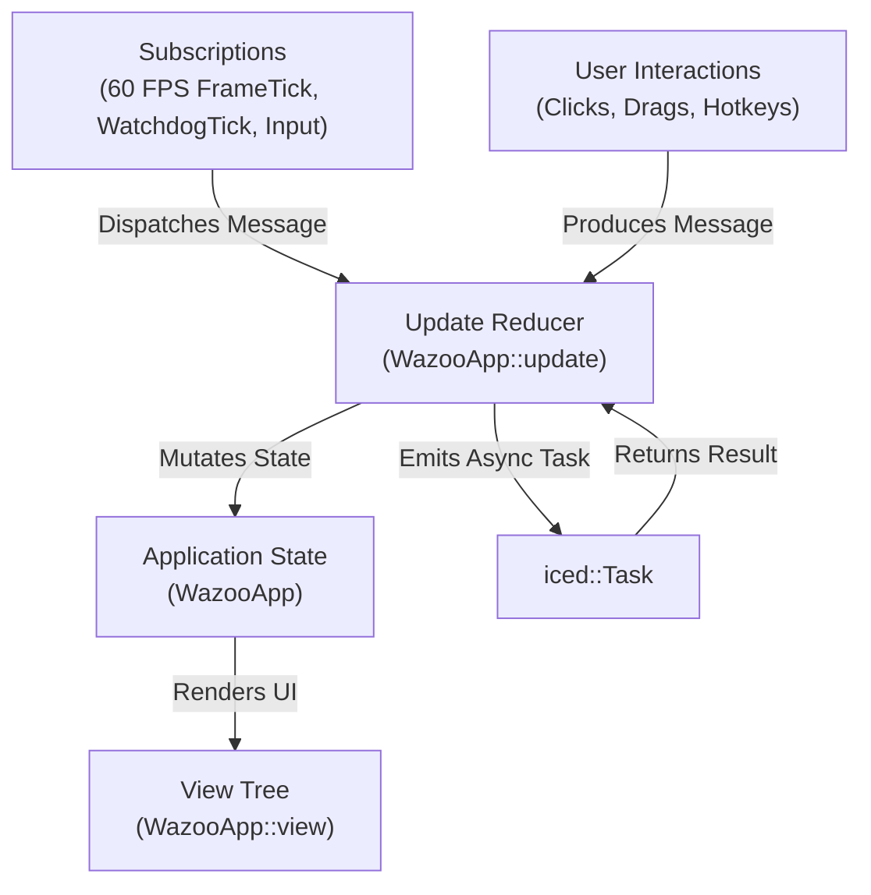
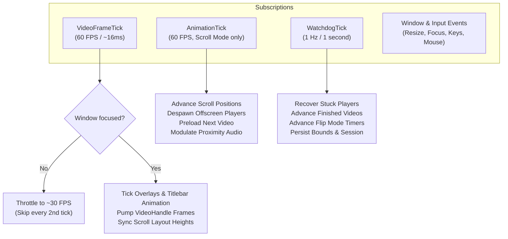

# `wazoo-app` Subsystem Architecture

The [`wazoo-app`] crate is the central desktop application. It integrates `wazoo-core`, `wazoo-media`, and `wazoo-scanner` using **The Elm Architecture (TEA)** pattern implemented with [Iced](https://github.com/iced-rs/iced).

---

## 📁 Module Organization

```
crates/wazoo-app/src/
├── app.rs          # WazooApp struct, state definitions, and helper methods
├── assets.rs       # Embedded font and SVG icon loaders
├── cli.rs          # Command-line interface argument parser
├── cursor.rs       # Frameless window resize cursor hit-testing and edge detection
├── format.rs       # Display name sanitization and title formatting utilities
├── keybinds.rs     # Key-to-message translation and custom shortcut binding
├── lib.rs          # Application entry point, window bootstrap, and run loop
├── main.rs         # Standalone binary entry point
├── message.rs      # Exhaustive enum of all UI and engine events (Message)
├── platform.rs     # OS-specific hooks (Linux PRIME check, console detaching)
├── scroll_view.rs  # Vertical feed layout container and shader quad integration
├── slide.rs        # Smooth animation curve and easing functions
├── state/          # Subsystem state encapsulations (players, overlays, flip timers)
├── theme/          # Custom color palettes, dark styling, and container themes
├── update/         # TEA state reducers partitioned by functional domain
└── views/          # Declarative Iced UI widgets, layouts, modals, and drawers
```

---

## 🏗️ The Elm Architecture (TEA) in Wazoo

Wazoo follows strict unidirectional data flow:



### State Decomposition (`WazooApp`)

To prevent a monolithic god object, application state in [`WazooApp`] is partitioned into focused child states:

- **`players: PlayerList`**: Collection of [`AppPlayer`] handles, each wrapping a `VideoHandle` with per-tile shuffle mode, undo/redo history stacks, loading state, and independent `FlipState`.
- **`window: WindowState`**: Tracks cursor position, focus status, Alt-drag movement, window resize directions, and mouse passthrough (ghost) mode.
- **`titlebar: TitlebarState`**: Controls sliding titlebar visibility, hover delays, hide timers, and dropdown menu slide transitions.
- **`overlay: OverlayState`**: Governs player HUD alpha fades, spinner rotation angles, toast alerts, and title pill badges.
- **`drawers: DrawerState`**: Holds visibility and search states for the File Browser, Subtitle Transcript, and Play History side drawers.
- **`modals: ModalState`**: Manages modal dialog visibility (Find/Search, Settings, Bookmarks, Help, Menu).
- **`settings: Settings`**: Active configuration loaded from `wazoo-core`.
- **`scroll_engine: ScrollEngine`**: Active layout and physics engine from `wazoo-media`.

---

## ⚡ The Modular Update Subsystem (`update/`)

Incoming [`Message`] events are dispatched through domain-specific reducers in [`crates/wazoo-app/src/update/`]:

| Module | Responsibility |
| :--- | :--- |
| [**`mod.rs`**] | Primary match dispatcher, `AnimationTick`, `VideoFrameTick`, and `WatchdogTick` orchestrators. |
| [**`window.rs`**] | Window focus, resize, move, Alt-drag, dropdown menu, click-through pinning, and titlebar animations. |
| [**`playback.rs`**] | Multi-tile playback commands, volume, mute, seek, A-B loop, speed, layout cycling, and audio tracks. |
| [**`navigation.rs`**] | Next/prev video, bi-directional navigation history stacks, and video auto-advancement. |
| [**`drawers.rs`**] | File picker navigation, folder collapsing, transcript cues, and play history clearing. |
| [**`modals.rs`**] | Settings tab switching, audio language preferences, equalizer sliders, and bookmarks. |
| [**`search.rs`**] | Search input changes, folder tag toggling, and instant query execution. |
| [**`scanner.rs`**] | Native folder pickers (`rfd`), scan progress updates, and library reloading. |
| [**`input.rs`**] | Hardware keyboard and mouse events mapped to configurable `KeyAction` commands. |

---

## ⏱️ Engine Ticks & Subscriptions

Wazoo maintains three distinct subscription timers:



### Video Frame Tick Optimizations

Inside [`Message::VideoFrameTick`]:
1. **Unfocused Throttling**: When the window is unfocused or occluded, frame ticks drop to ~30 FPS to reduce GPU swapchain pressure while keeping background movie playback smooth.
2. **Overlay & Debounce Ticks**: Ticks spinner angles, hud fades, and file picker search debouncing.
3. **Titlebar Animation Machine**: Runs titlebar slide transitions, drag detection timeouts, and dropdown menu animations.
4. **Frame Rendering**: Pumps `VideoHandle::update_frame()` across all active tiles.
5. **Scroll Layout Sync**: Adjusts scroll item heights dynamically when aspect ratios change.

---

## 🎨 View Layer & Components (`views/`)

Wazoo's user interface is fully custom and frameless:

- **Multi-Tile Playback Layouts ([`views/player/`]):**
  - **Grid**: Displays 1 to 12 players in an adaptive multi-column/row matrix.
  - **Row**: Aligns players horizontally in a continuous filmstrip.
  - **Column**: Stacks players vertically.
  - **Scroll**: Infinite vertical feed container rendered via [`scroll_view.rs`].
- **Frameless Titlebar ([`views/titlebar.rs`]):**
  - Slides down on hover or window movement; auto-retracts when idle.
  - Contains window controls (minimize, maximize, close), current video title, and quick drop-down menu.
- **Drawers:**
  - **File Picker ([`views/file_picker.rs`])**: Collapsible directory browser with video counts and instant search.
  - **Transcript ([`views/transcript.rs`])**: Synchronized dialogue subtitles with click-to-seek and track selector.
  - **Play History ([`views/history.rs`])**: Chronological session playback history with deduplication.
- **HUD Overlays:**
  - Transport controls (play/pause, volume slider, next/prev, shuffle toggle).
  - Visual A-B loop badges displaying active In and Out timestamps.
  - Toast message banner for instant feedback on hotkey actions.
