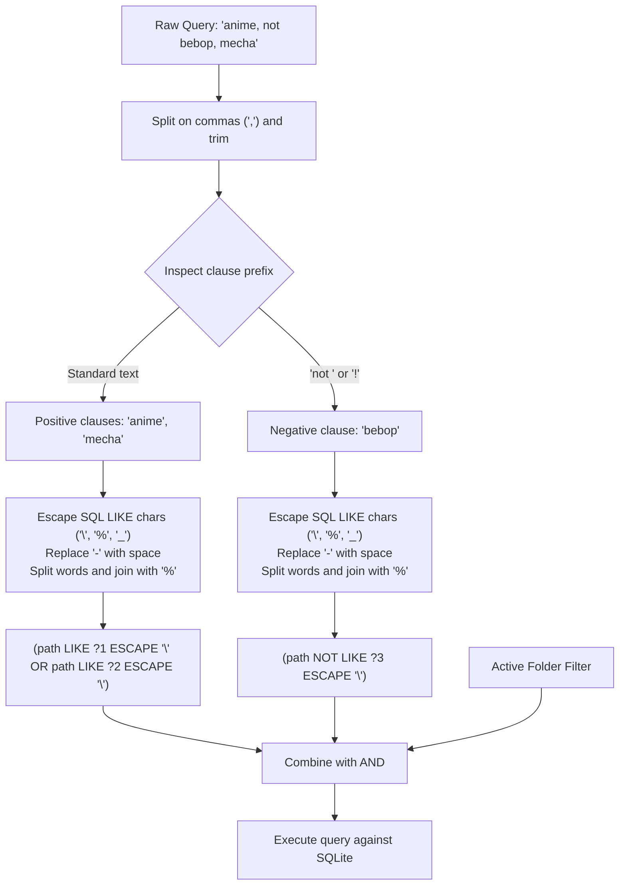

# `wazoo-core` Subsystem Architecture

The [`wazoo-core`] crate serves as the foundation for the Wazoo ecosystem. It encapsulates domain models, persistent configuration, the SQLite database layer, internationalization (i18n), and keybinding configuration without depending on any UI or audio/video decoding libraries.

---

## 📁 Module Organization

```
crates/wazoo-core/src/
├── config.rs    # Persistent configuration manager (atomic JSON writes & validation)
├── db.rs        # SQLite database operations, schema migrations, and search query builder
├── i18n.rs      # Internationalization engine (23 languages, interpolation, RTL support)
├── keybinds.rs  # Keyboard action mappings, custom keybindings, and help categories
├── lib.rs       # Crate root and public re-exports
└── models.rs    # Canonical domain types and data transfer objects
```

---

## 🗄️ SQLite Database & Search Engine (`db.rs`)

The [`Database`] struct manages the local SQLite database (`wazoo.db`) using `rusqlite`.

### Schema & Indexing

```sql
CREATE TABLE IF NOT EXISTS Video (
    id INTEGER PRIMARY KEY AUTOINCREMENT,
    name TEXT NOT NULL,
    path TEXT NOT NULL UNIQUE,
    folder TEXT
);

CREATE INDEX IF NOT EXISTS path_idx ON Video(path);
CREATE INDEX IF NOT EXISTS name_idx ON Video(name);
CREATE INDEX IF NOT EXISTS folder_idx ON Video(folder);
```

### Search Query Compilation Logic

The [`search_videos`] method implements a custom search engine designed to handle complex human queries across large video libraries:



#### Query Features:
1. **Multi-term OR**: Comma-separated positive clauses match if *any* positive term is present.
2. **Negation Filtering**: Terms prefixed with `not ` or `!` ensure excluded words never appear.
3. **Punctuation Normalization**: Hyphens are transformed to spaces and multi-word terms are wildcard-delimited (`%word1%word2%`) to match messy torrent filenames.
4. **Folder Scoping**: Supports filtering across specific folders, sub-paths, or the virtual `Misc` folder.

---

## ⚙️ Persistent Configuration (`config.rs`)

The [`ConfigManager`] handles user preferences stored in `settings.json`.

### Platform Configuration Paths

Resolved via the `directories` crate:
- **Linux:** `~/.config/wazoo/settings.json`
- **Windows:** `%APPDATA%\alkalisoftworks\wazoo\config\settings.json`
- **macOS:** `~/Library/Application Support/com.alkalisoftworks.wazoo/settings.json`

### Atomic File Write Pattern

To prevent corrupted settings if the app or OS terminates abruptly, `save_settings` uses atomic replacement:
1. Serialize settings into a temporary file: `settings.json_new`.
2. Flush and sync file contents to disk.
3. Call `std::fs::rename("settings.json_new", "settings.json")` to atomically swap the file pointer at the filesystem level.

### Value Clamping & Sanitization

All incoming values are clamped to safe ranges on load and save:
- `flip_interval_secs`: `1..=3600` (default: `45`s)
- `buffer_duration_secs`: `2..=300` (default: `10`s)
- `buffer_size_mb`: `8..=4096` (default: `32` MB)
- `window_opacity`: `0.05..=1.0` (default: `1.0`)
- `window_bounds`: width `200..=7680`, height `150..=4320`
- `gamma`, `contrast`, `brightness`, `saturation`: `-100.0..=100.0` (default: `0.0`)
- `playback_speed`: `0.25..=4.0` (default: `1.0`)
- `cube_speed`: `0.2..=4.0` (default: `1.0`)
- `cube_size`: `0.4..=3.0` (default: `1.0`)
- `keybinds`: Automatically reconciles with complete defaults via `reconcile_with_defaults()` if keys are missing from older config versions.

---

## 🌐 Internationalization Engine (`i18n.rs`)

Wazoo contains 100% offline, embedded localization files for 23 languages:

| Code | Language | Script Direction |
| :--- | :--- | :--- |
| `en` | English | LTR |
| `nl` | Dutch | LTR |
| `es` | Spanish | LTR |
| `fr` | French | LTR |
| `it` | Italian | LTR |
| `pt` | Portuguese | LTR |
| `de` | German | LTR |
| `cs` | Czech | LTR |
| `pl` | Polish | LTR |
| `uk` | Ukrainian | LTR |
| `ru` | Russian | LTR |
| `sv` | Swedish | LTR |
| `tr` | Turkish | LTR |
| `ar` | Arabic | **RTL** |
| `he` | Hebrew | **RTL** |
| `fa` | Persian (Farsi) | **RTL** |
| `hi` | Hindi | LTR |
| `bn` | Bengali | LTR |
| `th` | Thai | LTR |
| `vi` | Vietnamese | LTR |
| `zh` | Simplified Chinese | LTR |
| `ja` | Japanese | LTR |
| `ko` | Korean | LTR |

### Interpolation & Fallback Logic

- [`t(key)`]: Looks up the translation key in the active language catalog. If missing, it automatically falls back to English (`en`).
- [`t_with(key, &[("name", val)])`]: Replaces `{name}` placeholders inside translated strings dynamically.
- [`is_rtl()`]: Returns true for Arabic (`ar`), Hebrew (`he`), and Persian (`fa`), enabling right-to-left layout alignment in UI widgets.

---

## ⌨️ Keybindings Subsystem (`keybinds.rs`)

The [`KeybindSettings`] structure manages physical keyboard mappings:

- **Action Enum ([`KeyAction`])**: Exhaustive list of bindable application commands (`PlayPause`, `ToggleMute`, `VolumeUp`, `VolumeDown`, `NextVideo`, `PrevVideo`, `AddPlayer`, `RemovePlayer`, `CycleLayout`, `ToggleFilePicker`, `ToggleSearch`, `ToggleFlipMode`, `ToggleScrollMode`, `MarkIn`, `MarkOut`, etc.).
- **User Customization**: Overrides are stored in `settings.json` under `"keybinds": { ... }`.
- **Help Documentation Generator**: Automatically categorizes shortcuts into structured groups ([`HelpCategory`]) for the in-app help modal.
