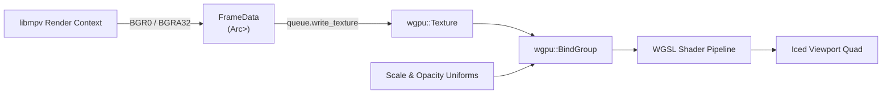
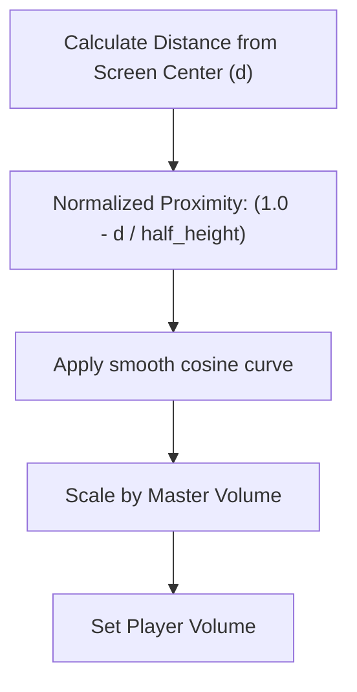

# `wazoo-media` Subsystem Architecture

The [`wazoo-media`] crate is the media playback and presentation engine of Wazoo. It bridges native `libmpv` decoding to Iced's WGPU rendering pipeline, provides continuous vertical scroll layout calculations, and parses interactive subtitle cues.

---

## 📁 Module Organization

```
crates/wazoo-media/src/
├── lib.rs            # Crate root and high-level re-exports
├── mpv_ffi.rs        # Low-level C FFI bindings & dynamic loader for libmpv
├── pipeline.rs       # Custom WGPU shader pipeline and texture cache
├── player/           # High-level video playback handles & track controls
│   ├── handle.rs     # VideoHandle implementation (libmpv lifecycle, frames, playback)
│   ├── mod.rs        # Player module root
│   ├── state.rs      # PlayerState and BufferConfig structures
│   └── tracks.rs     # Audio and Subtitle track management & preference matching
├── scroll.rs         # Continuous scroll feed physics and volume falloff engine
└── subtitles.rs      # Subtitle transcript parsing (.srt, .ass) & FFmpeg extraction
```

---

## 🎬 `libmpv` FFI Bridge (`mpv_ffi.rs`)

The media engine wraps `libmpv` directly via C FFI.

### Dynamic Symbol Resolution

To provide maximum portability across operating systems and distribution packaging:
1. `mpv_ffi` first attempts to dynamically load `libmpv` at runtime:
   - **Linux:** `libmpv.so.2`, `libmpv.so.1`
   - **macOS:** `libmpv.dylib`
   - **Windows:** Embedded inside the portable binary or loaded from `mpv-2.dll` / `mpv-1.dll`.
2. If dynamic loading fails, it falls back to linked C symbols resolved at build time.

### `libmpv` Configuration & Hardening

Each player instance is initialized with options tuned for multi-window ambient playback:
- `vo=libmpv`: Uses the software rendering context rather than native OS window handles.
- `hwdec`: Configurable via the `WAZOO_HWDEC` environment variable (defaults to software decoding `no` to eliminate GPU driver deadlocks when windows are occluded or behind other apps).
- `demuxer-readahead-secs` & `demuxer-max-bytes`: Configured by [`BufferConfig`] to keep memory usage bounded across multiple concurrent players.
- `force-seekable=yes` & `hr-seek-framedrop=yes`: Ensures ultra-responsive scrubbing and random seeking.

---

## 🖼️ WGPU Presentation Pipeline (`pipeline.rs`)

Rather than letting `libmpv` draw directly to an OS window, Wazoo renders frames into GPU textures inside Iced's WGPU pipeline via [`VideoPipeline`].



### Advantages of Shader-Based Rendering:
1. **Multi-Player Scalability**: Can render 1 to 12 simultaneous video players within a single native window without multiple X11/Wayland sub-windows.
2. **Dynamic Window Opacity**: Opacity transitions and transparency are applied directly in the fragment shader without OS compositor glitches.
3. **Zero-Copy Video Swapchains**: Only textures that received a new frame on the tick are updated on the GPU.

---

## 🎮 Video Player Handle (`player/handle.rs`)

The [`VideoHandle`] struct provides the ergonomic, safe Rust API for managing an active video stream:

### Key Features:
- **Playback Controls**: `play()`, `pause()`, `toggle_pause()`, `seek_relative(seconds)`, `seek_percent(pct)`, `seek_random()`.
- **A-B Looping**: `set_mark_in()`, `set_mark_out()`, `clear_mark_in()`, `clear_mark_out()`. When active, `libmpv` automatically loops between marked timestamps.
- **Software Video Equalizer**: Constructs FFmpeg `eq` video filter strings dynamically for `gamma`, `contrast`, `brightness`, and `saturation`.
- **Watchdog Protection**: `check_stuck()` detects when a player is supposed to be playing but has not advanced its playback timestamp for 30 seconds (`STUCK_THRESHOLD_SECONDS`), triggering an automatic recovery or advance.

---

## 🌊 Continuous Scroll Engine (`scroll.rs`)

The [`ScrollEngine`] powers the infinite vertical video feed (Scroll Mode):

### 1. Aspect-Ratio Dependent Layout

Videos are not forced into rigid boxes. The layout engine calculates each tile's real display height using its native aspect ratio:

$$\text{Height} = \frac{\text{Window Width}}{\text{Aspect Ratio}}$$

### 2. Lookahead Margins & Preloading

To ensure smooth scrolling without blank frames:
- `needs_new_player_with_margin(margin)` checks if the bottom of the lowest video is within `1.5 * default_item_height` of the screen viewport.
- The app preloads the next video in the background so it attaches seamlessly the moment it scrolls into range.

### 3. Proximity-Based Audio Crossfading

Volume is modulated by the player's distance from the vertical center of the window:



---

## 📜 Subtitle Transcript Engine (`subtitles.rs`)

The subtitle subsystem extracts and parses timed dialogue lines:

1. **Sidecar File Parsing**: Checks for adjacent subtitle files (`.srt`, `.vtt`, `.ass`, `.ssa`).
2. **Container Stream Extraction**: Uses an asynchronous background `ffmpeg` process to extract embedded subtitle tracks without freezing playback.
3. **Timestamp Normalization**: Parses various timestamp conventions (`00:01:23,450`, `00:01:23.450`, `0:01:23.45`) into floating-point seconds ([`SubtitleCue`]).
4. **Interactive Seeking**: Clicking any cue in the transcript drawer dispatches a seek command to that cue's `start_secs`.
