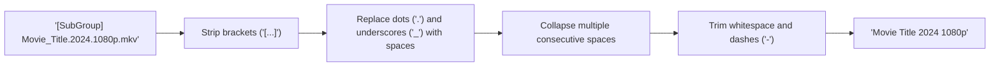
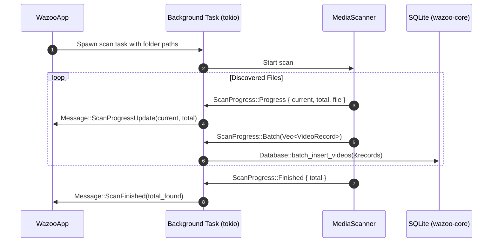

# `wazoo-scanner` Subsystem Architecture

The [`wazoo-scanner`] crate manages recursive directory traversal, filename sanitization, and asynchronous ingestion of media libraries into the local SQLite database.

---

## 📁 Module Organization

```
crates/wazoo-scanner/src/
└── lib.rs  # MediaScanner implementation, path filtering, and database ingestion
```

---

## 🔍 Directory Discovery & Traversal

The scanner utilizes the `walkdir` crate to crawl designated folders on background worker threads.

### Supported File Formats

Supported video extensions defined in [`VIDEO_EXTENSIONS`]:
- **`.mkv`** (Matroska)
- **`.mp4`** (MPEG-4)
- **`.avi`** (Audio Video Interleave)
- **`.mov`** (QuickTime)
- **`.webm`** (WebM)

Validation is performed by [`is_video_file`], which inspects the path extension case-insensitively.

---

## 🏷️ Filename Sanitization (`clean_video_name`)

Media filenames frequently contain release group tags, video resolutions, and codec labels that clutter the user interface.

[`clean_video_name`] normalizes these names for display:



> [!NOTE]
> The original canonical path on disk is always preserved in [`VideoRecord::path`] to ensure media engines load the correct file. Only the user-facing title is sanitized.

---

## ⚡ Streaming Pipeline & Real-Time Progress

To handle large libraries (50,000+ files) smoothly without memory spikes or freezing the UI, scanning operates over a `tokio::sync::mpsc` channel:



### Cancellation Support
The scanner accepts an `Arc<AtomicBool>` cancellation token. If the user dismisses the scan modal or exits the application, directory traversal halts immediately on the next iteration.
