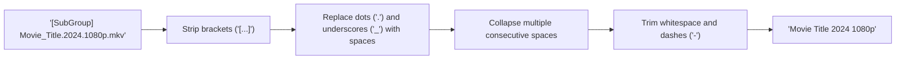

# `wazoo-scanner` Subsystem Architecture

The [`wazoo-scanner`] crate manages recursive directory traversal, filename sanitization, and asynchronous ingestion of media libraries into the local SQLite database.

---

## 📁 Module Organization

```
crates/wazoo-scanner/src/
└── lib.rs  # Scanner implementation, two-phase traversal, and streaming ingestion
```

---

## 🔍 Directory Discovery & Traversal

The scanner utilizes the `walkdir` crate to crawl designated folders on background worker threads.

### Supported File Formats

Supported video extensions defined in [`VIDEO_EXTENSIONS`]:
- **`.mkv`** (Matroska)
- **`.mp4`** (MPEG-4)
- **`.avi`** (Audio Video Interleave)
- **`.mov`** (QuickTime)
- **`.webm`** (WebM)

Validation is performed by [`is_video_file`], which inspects the path extension case-insensitively.

---

## 🏷️ Filename Sanitization (`clean_video_name`)

Media filenames frequently contain release group tags, video resolutions, and codec labels that clutter the user interface.

[`clean_video_name`] normalizes these names for display:



> [!NOTE]
> The original canonical path on disk is always preserved in [`VideoRecord::path`] to ensure media engines load the correct file. Only the user-facing title is sanitized.

---

## ⚡ Two-Phase Streaming Pipeline & Progress

To handle large libraries (50,000+ files) smoothly without memory spikes or freezing the UI, [`Scanner::scan_and_index_with_cancel`] executes in two distinct phases:

1. **Phase 1: Listing (`ScanStage::Listing`)**: Quickly counts total video files across immediate roots and subdirectories without touching SQLite or cleaning titles. Provides an accurate total count for smooth percentage calculations and immediate UI feedback.
2. **Phase 2: Indexing (`ScanStage::Indexing`)**: Performs deduplication against visited paths, applies [`clean_video_name`], chunks discovered records, executes batch SQLite transactions (`batch_insert_videos`), and emits real-time progress updates (`files_found`, `percent`, `current_name`).

```mermaid
sequenceDiagram
    autonumber
    participant App as WazooApp
    participant Task as Background Task (tokio)
    participant Scanner as Scanner (wazoo-scanner)
    participant DB as SQLite (wazoo-core)

    App->>Task: Spawn scan task with folder paths & cancel token
    Task->>Scanner: scan_and_index_with_cancel(folders, db_path, tx, cancel)
    
    rect rgb(30, 40, 50)
        note right of Scanner: Phase 1: Listing
        loop Traverse Roots & Subdirectories
            Scanner->>Task: ScanProgress { stage: Listing, processed, total }
            Task->>App: Message::ScanProgressUpdate(progress)
        end
    end

    rect rgb(30, 50, 40)
        note right of Scanner: Phase 2: Indexing & Ingestion
        loop Process & Insert Discovered Videos
            Scanner->>Scanner: clean_video_name & deduplicate
            Scanner->>DB: Database::batch_insert_videos(&records)
            Scanner->>Task: ScanProgress { stage: Indexing, processed, total, percent, current_name }
            Task->>App: Message::ScanProgressUpdate(progress)
        end
    end

    Scanner->>Task: Ok(total_indexed)
    Task->>App: Message::ScanFinished(total_found)
```



### Cancellation Support
The scanner accepts an `Arc<AtomicBool>` cancellation token checked throughout both phases. If the user dismisses the scan modal or exits the application, directory traversal and batch insertion halt immediately.
